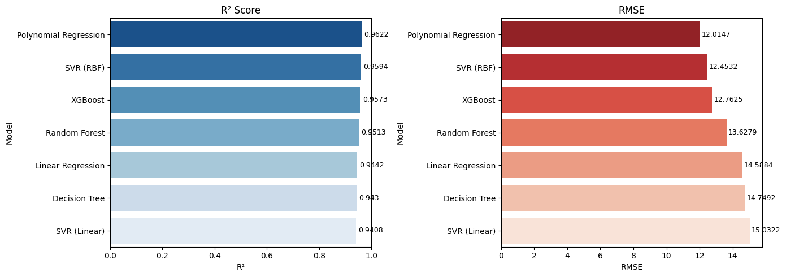
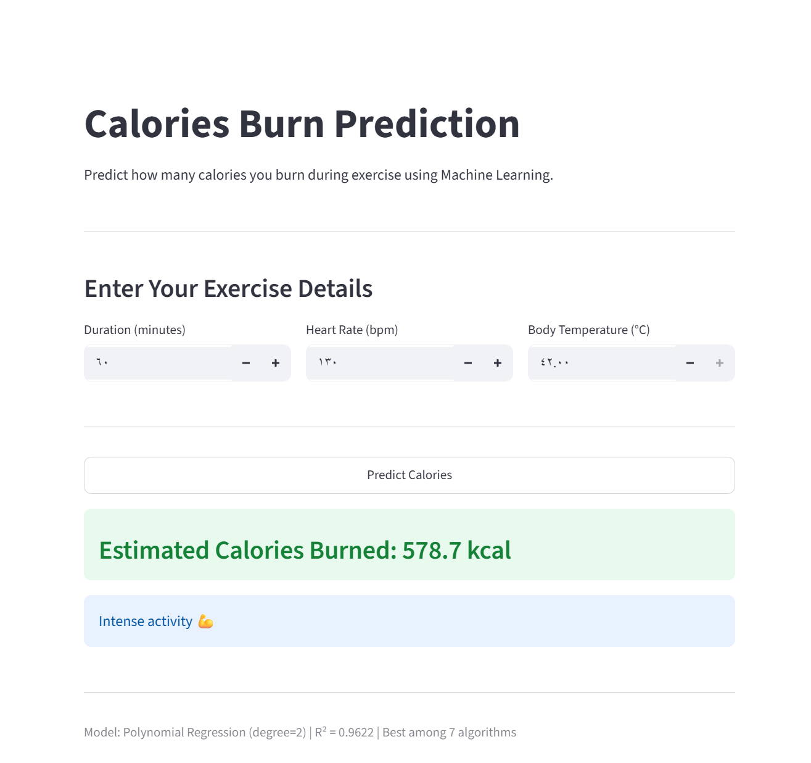

# Calories Burn Prediction

Predicting calories burned during exercise using multiple machine learning regression models.

## Overview

People are increasingly focused on managing their health and fitness goals. Accurately predicting calories burned during exercise helps individuals tailor their diet and workout plans effectively. This project explores which physiological factors most influence calorie burning, and compares six regression algorithms to find the best predictive model.

## Dataset

- Source: [Kaggle - Exercise & Calories Dataset](https://www.kaggle.com/datasets/fmendes/fmendesdat263xdemos)
- Files: exercise.csv + calories.csv merged on User_ID
- Total: 15,000 observations, 9 features
- Features used: Duration, Heart_Rate, Body_Temp
- Target: Calories

## Exploratory Data Analysis

Correlation analysis revealed that Duration, Heart_Rate, and Body_Temp have the strongest positive relationship with calories burned. Height, Weight, and Gender showed negligible impact and were excluded from modeling.

## Models Compared

| Model | R² | RMSE |
|-------|----|------|
| Polynomial Regression (degree=2) | 0.9626 | 11.95 |
| SVR (RBF) | 0.9613 | 12.16 |
| XGBoost | 0.9598 | 12.38 |
| Random Forest | 0.9524 | 13.48 |
| Linear Regression | 0.9476 | 14.14 |
| Decision Tree | 0.9433 | 14.71 |

## Results

## Key Findings

- Best performing model: Polynomial Regression with R² = 0.9626 and RMSE = 11.95 — the highest accuracy among all models.
- SVR (RBF) comes in second (R² = 0.9613), followed by XGBoost (R² = 0.9598) — both handle non-linearity well.
- All models achieved R² above 0.94, indicating strong predictive power across the board.
- Duration is the dominant feature, contributing 0.93 and 0.95 importance in Random Forest and XGBoost respectively.
- This explains why Polynomial Regression performs best — when a single feature dominates, a simple non-linear transformation is enough.
- Hyperparameter tuning (degree, n_estimators, learning_rate) had minimal impact on results — the differences between models are inherent to their structure, not tuning.

## Live Demo

Try the app: https://calories-burn-prediction-kegtltzv3puxwgcbfez4nq.streamlit.app

## Requirements

pip install numpy pandas matplotlib seaborn scikit-learn xgboost streamlit

## How to Run

1. Download the dataset from Kaggle (link above)
2. Place exercise.csv and calories.csv in the project root
3. Open calories_burn_prediction.ipynb in Jupyter
4. Run all cells

## Project Structure

calories-burn-prediction/
├── calories_burn_prediction.ipynb
├── app.py
├── model.pkl
├── requirements.txt
├── README.md
└── (exercise.csv + calories.csv) — download separately
